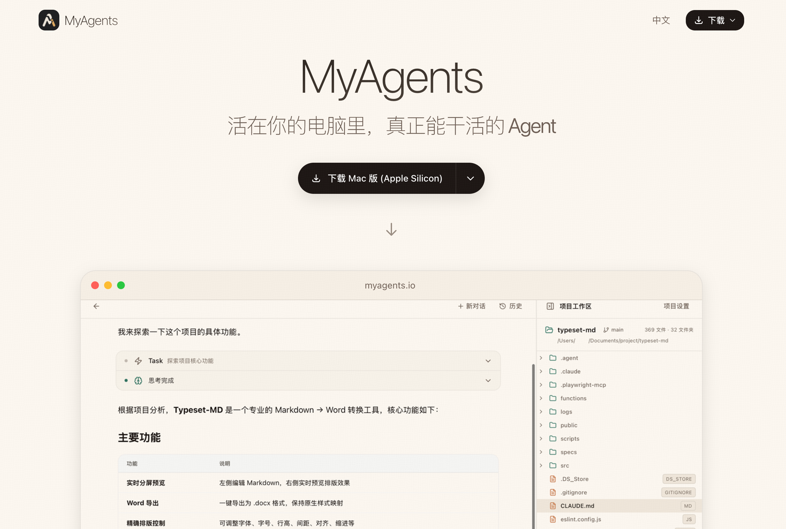

<div align="center">

# MyAgents

**活在你的电脑里，真正能干活的个人 Agent**

[中文](#中文) | [English](#english)

[](LICENSE)
[](https://www.apple.com/macos/)
[](https://myagents.io)

**官网**: [https://myagents.io](https://myagents.io)



</div>

---

<a name="中文"></a>

## 中文

MyAgents 基于 Claude Agent SDK 运行的**桌面端通用 Agent 产品**，将强大的 Agent 能力带到桌面端，通过直观的图形界面，让每个人都能轻松驾驭 AI 的力量。无需命令行，无需编程经验，只需对话，即可完成复杂任务。

截止 2026 年 1 月，AI 的智能飞速提升，已经让软件开发者首先变成了十倍百倍生产力的人。而 2026 年注定是智能丰裕的元年，我们希望这股 AI 的力量能被更多的人所掌握，无论你是学生、内容创作者、教育工作者、各种行业专家、产品经理等任何一个「想要去做些什么的人」。我们希望「MyAgents」能为你的电脑注入灵魂，让他成为你的思维放大器，将你的品味、想法变成现实对世界产生更大的影响。

因此 MyAgents 最核心的功能，**图形界面零门槛、多模型供应商随意选、数据本地存储、产品开源免费。**

### 快速体验
- 直接访问 https://myagents.io 点击下载安装包
- Mac 版本 支持 Apple Silicon 和 Intel 芯片
- Win 版本即将支持

### 功能特性

- **原生桌面应用** - macOS 原生体验，Chrome 风格无边框窗口
- **多标签页** - 同时管理多个项目会话，支持拖拽排序
- **多实例并发** - 每个 Tab 独立 Sidecar，真正的并行工作
- **智能对话** - 基于 Claude Agent SDK，最高质量的框架策略
- **多项目管理** - 在不同代码仓库间切换
- **本地运行** - 数据不离开本机
- **静默自动更新** - Chrome 风格后台更新，就绪后一键重启
- **Slash Commands** - 支持内置和自定义快捷指令
- **多模型切换** - 支持 Anthropic 及第三方供应商
- **快捷键支持** - Cmd+T 新建 Tab，Cmd+W 关闭 Tab
- **MCP 集成** - 支持 STDIO/HTTP/SSE 三种传输协议
- **工具权限管理** - 三种权限模式（行动/规划/自主行动）
- **配置管理** - 可视化编辑 CLAUDE.md、Skills 和 Commands

### 支持的模型供应商

| 供应商 | 模型 | 类型 |
|--------|------|------|
| Anthropic | Claude Sonnet/Haiku/Opus 4.5 | 订阅/API |
| DeepSeek | DeepSeek Chat, Reasoner | API |
| Moonshot | Kimi K2 | API |
| 智谱 AI | GLM 4.7, 4.5 Air | API |
| MiniMax | M2.1, M2.1 Lightning | API |
| 火山引擎 | ark-code-latest, Doubao-Seed-Code | API |
| OpenRouter | GPT-5.2, Gemini 3 等多模型 | API |

### 系统要求

#### 最终用户

- **macOS 13.0 (Ventura)** 或更高版本
- 支持 Apple Silicon (M1/M2/M3) 和 Intel 芯片

#### 开发者

- macOS 13.0+
- [Node.js](https://nodejs.org) (v18+)
- [Bun](https://bun.sh) - 开发时需要，最终用户无需安装
- [Rust](https://rustup.rs)

### 快速开始（开发者）

#### 安装

```bash
git clone https://github.com/hAcKlyc/MyAgents.git
cd MyAgents
./setup.sh
```

#### 构建

```bash
# Debug 构建 (含 DevTools)
./build_dev.sh

# 生产构建 (macOS DMG)
./build_macos.sh
```

### 技术栈

| 组件 | 技术 |
|------|------|
| 前端 | React + TypeScript + TailwindCSS |
| 桌面 | Tauri v2 |
| 后端 | Bun + Claude Agent SDK (多实例) |
| 通信 | Rust HTTP/SSE Proxy (reqwest) |
| 拖拽 | @dnd-kit/sortable |

### 架构

多实例 Sidecar 架构：每个 Tab 拥有独立的后端进程和 SSE 连接。

```
┌─────────────────────────────────────────────┐
│  Tab1 (WS-A)    Tab2 (WS-B)    Settings     │
│      │              │              │        │
│      ▼              ▼              ▼        │
│  Sidecar:31415  Sidecar:31416  Global:31417 │
└─────────────────────────────────────────────┘
```

所有 HTTP/SSE 流量通过 Rust 代理层，完全绕过 WebView CORS 限制：

```
前端 ──(invoke)──> Rust Proxy ──(reqwest)──> Bun Sidecar
         <──(emit sse:tabId:event)──
```


### 贡献

请参阅 [CONTRIBUTING.md](CONTRIBUTING.md) 了解贡献指南。

### 许可证

[Apache License 2.0](LICENSE)

---

<a name="english"></a>

## English

MyAgents is a **desktop general-purpose Agent product** powered by Claude Agent SDK, bringing powerful Agent capabilities to your desktop. Through an intuitive graphical interface, anyone can harness the power of AI. No command line, no programming experience needed — just chat and accomplish complex tasks.

As of January 2026, AI intelligence has advanced rapidly, turning software developers into people with 10x or even 100x productivity. 2026 is destined to be the first year of intelligence abundance. We hope this AI power can be harnessed by more people — whether you're a student, content creator, educator, industry expert, product manager, or anyone who "wants to make something happen." We hope MyAgents can breathe a soul into your computer, turning it into your thought amplifier, transforming your taste and ideas into reality to make a greater impact on the world.

Therefore, MyAgents' core principles are: **zero-barrier GUI, flexible model provider choices, local data storage, and open-source freedom.**

### Quick Download
- Visit https://myagents.io to download the installer
- Mac version supports both Apple Silicon and Intel chips
- Windows version coming soon

### Features

- **Native Desktop App** - macOS native experience with Chrome-style frameless window
- **Multi-Tab Support** - Manage multiple project sessions simultaneously with drag-and-drop sorting
- **Multi-Instance Concurrency** - Each tab has its own Sidecar process for true parallel work
- **Smart Conversations** - Powered by Claude Agent SDK with best-in-class framework strategies
- **Multi-Project Management** - Switch between different code repositories
- **Local Execution** - Your data never leaves your machine
- **Silent Auto-Update** - Chrome-style background updates, restart when ready
- **Slash Commands** - Built-in and custom shortcut commands
- **Multi-Model Support** - Anthropic and third-party providers
- **Keyboard Shortcuts** - Cmd+T for new tab, Cmd+W to close tab
- **MCP Integration** - STDIO/HTTP/SSE transport protocols
- **Tool Permissions** - Three permission modes (Act/Plan/Auto)
- **Config Management** - Visual editing for CLAUDE.md, Skills, and Commands

### Supported Model Providers

| Provider | Models | Type |
|----------|--------|------|
| Anthropic | Claude Sonnet/Haiku/Opus 4.5 | Subscription/API |
| DeepSeek | DeepSeek Chat, Reasoner | API |
| Moonshot | Kimi K2 | API |
| Zhipu AI | GLM 4.7, 4.5 Air | API |
| MiniMax | M2.1, M2.1 Lightning | API |
| Volcengine | ark-code-latest, Doubao-Seed-Code | API |
| OpenRouter | GPT-5.2, Gemini 3 and more | API |

### System Requirements

#### End Users

- **macOS 13.0 (Ventura)** or later
- Apple Silicon (M1/M2/M3) and Intel supported

#### Developers

- macOS 13.0+
- [Node.js](https://nodejs.org) (v18+)
- [Bun](https://bun.sh) - Required for development only
- [Rust](https://rustup.rs)

### Quick Start (Developers)

#### Installation

```bash
git clone https://github.com/hAcKlyc/MyAgents.git
cd MyAgents
./setup.sh
```

#### Build

```bash
# Debug build (with DevTools)
./build_dev.sh

# Production build (macOS DMG)
./build_macos.sh
```

### Tech Stack

| Component | Technology |
|-----------|------------|
| Frontend | React + TypeScript + TailwindCSS |
| Desktop | Tauri v2 |
| Backend | Bun + Claude Agent SDK (multi-instance) |
| Communication | Rust HTTP/SSE Proxy (reqwest) |
| Drag & Drop | @dnd-kit/sortable |

### Architecture

Multi-instance Sidecar architecture: each tab owns an independent backend process and SSE connection.

```
┌─────────────────────────────────────────────┐
│  Tab1 (WS-A)    Tab2 (WS-B)    Settings     │
│      │              │              │        │
│      ▼              ▼              ▼        │
│  Sidecar:31415  Sidecar:31416  Global:31417 │
└─────────────────────────────────────────────┘
```

All HTTP/SSE traffic goes through Rust proxy layer, completely bypassing WebView CORS restrictions:

```
Frontend ──(invoke)──> Rust Proxy ──(reqwest)──> Bun Sidecar
            <──(emit sse:tabId:event)──
```

### Contributing

See [CONTRIBUTING.md](CONTRIBUTING.md) for contribution guidelines.

### License

[Apache License 2.0](LICENSE)
